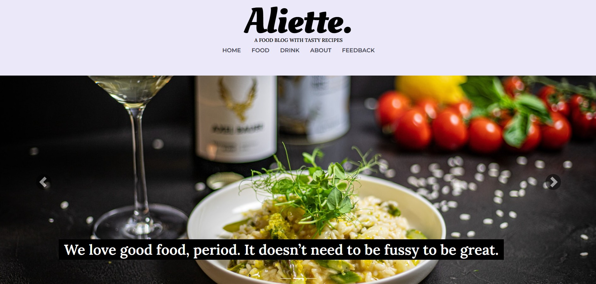

# Creating single Vue components in WordPress theme without bundler

The purpose of this repository is to demonstrate how to add single Vue elements to a WordPress theme. You don't need to use any bundler or to install NPM packages. Installing Vue using NPM is recommended for building larger Vue applications. In such cases, a build tool must be installed along with the NPM packages to handle the application's bundling. More information about <a href="https://github.com/anitape/vue-in-wordpress-theme/tree/master/frontend">developing a Wordpress theme with Vue and Vue CLI bundler you can find here</a>.

For smaller dynamic features, Vue.js can be added to a WordPress theme using a <b>CDN</b> installation. In this approach, Vue components are added to JavaScript <b><i>.js</i></b> files instead of <b><i>.vue</i></b> files. To manage Vue components, a <b><i>js</i></b> directory is created within the WordPress theme to store JavaScript files containing Vue code. It is advisable to organize the JavaScript files based on the functionalities being implemented. For example, if the page includes three different features, such as a slider, a dropdown menu, and dynamic tabs, the <b><i>js</i></b> folder should contain three separate JavaScript files.

Below is an instruction how to add Vue components to a WordPress theme using only CDN and JavaScript.


<b>Table of contents</b>

- [1. Adding necessary scripts](#1-adding-necessary-scripts)
- [2. Dropdown element](#2-dropdown-element)
- [3. Slider element](#3-slider-element)
- [4. Tab element](#4-tab-element)


## 1. Adding necessary scripts

JavaScript scripts are added to WordPress using the ```wp_enqueue_script()``` function, which includes the <b>CDN link</b> in the <b><i>functions.php</i></b> file. Each JavaScript file must be linked to the WordPress theme through this function. Below is an example of how to add these files to a WordPress theme. When adding JavaScript files, the value ```true``` should be passed as the last argument in the ```wp_enqueue_script()``` function. This places the JavaScript file in the footer, ensuring that Vue functionalities are executed only after the DOM tree has fully loaded.


<b>functions.php</b>

```
function essential_scripts() {

    wp_enqueue_script(
        'vue',
        'https://cdnjs.cloudflare.com/ajax/libs/vue/3.2.39/vue.global.min.js',
        [],
        '3.2.39'
    );

    wp_enqueue_script(
        'dropdowns',
        get_template_directory_uri() . '/js/dropdowns.js',
        ['vue'],
        '0.1.0',
        true
    );

    wp_enqueue_script(
        'slider',
        get_template_directory_uri() . '/js/slider.js',
        ['vue'],
        '0.1.0',
        true
    );

    wp_enqueue_script(
        'tabs',
        get_template_directory_uri() . '/js/tabs.js',
        ['vue'],
        '0.1.0',
        true
    );
}

add_action('wp_enqueue_scripts', 'essential_scripts');
```


## 2. Dropdown element

The example code below demonstrates a Vue component that manages the visibility of a dropdown menu. This Vue component includes an ```isVisible``` variable and a ```makeVisible``` function. The initial state of the ```isVisible``` variable is ```hidden```, meaning the dropdown menu is hidden. The ```makeVisible``` function toggles the state to show or hide the menu as needed. The entire Vue component is wrapped inside a self-executing function. This Vue component is mounted to an HTML element with the <b><i>ID</i></b> ```#my-first-dropdown```.


<b>dropdown.js</b>

```
(function () {

        const { createApp } = Vue

        createApp({
            data() {
                return {
                    isVisible: 'hidden',
                }
            },
            methods: {
                makeVisible() {
                    if (this.isVisible === 'hidden') {
                        this.isVisible = 'visible'
                    } else { this.isVisible = 'hidden' }
                }
            }
        }).mount('#my-first-dropdown')
})();
```


The same Vue components can be reused across multiple parts of a WordPress theme. For instance, if a WordPress theme contains multiple dropdown menus, a single Vue component can manage them all. In such cases, all main elements of the dropdown menus must share the same class. In this example, the <b><i>class</i></b> ```.menu-dropdown``` is used to enable the dropdown functionality. The dropdown menus are selected using the ```querySelectorAll()``` method, and each selected element is iterated over with the ```forEach()``` method. The example code below illustrates how these methods are used within a Vue component. 


<b>dropdowns.js</b>

```
(function () {

    document.querySelectorAll('.menu-dropdown').forEach((element) => {
        const { createApp } = Vue

        createApp({
            data() {
                return {
                    isVisible: 'hidden',
                }
            },
            methods: {
                makeVisible() {
                    if (this.isVisible === 'hidden') {
                        this.isVisible = 'visible'
                    } else { this.isVisible = 'hidden' }
                }
            }
        }).mount(element)
    })
})();
```


The example below demonstrates the HTML structure of a dropdown menu, where the main element has the <b><i>class</i></b> ```.menu-dropdown```. The dropdown menu's header is controlled by a button that includes the ```v-on``` directive, triggering the ```makeVisible()``` function when clicked. The dropdown menu content is contained within a ```div``` element with the <b><i>class</i></b> ```.food-dropdown-menu```. This ```div``` element also features a dynamic visibility style property, which is bound to the ```isVisible``` variable.


<b>archive-food_recipes.php, archive-drinks.php, taxonomy-course.php, taxonomy-drink_types.php, taxonomy-occasion_drinks.php, taxonomy-occasion.php, taxonomy-season.php</b>

```
<div class="menu-dropdown">
    <div class="dropdown">
        <button type="button" class="btn-category" v-on:click="makeVisible">
             <span>Select Category</span> <i class="fa fa-angle-down" aria-hidden="true"></i>
        </button>
        <div class="food-dropdown-menu" :style="{ 'visibility': isVisible}">
            <?php 
                $taxonomies = get_object_taxonomies( 'food_recipes', 'objects' );

                foreach( $taxonomies as $taxonomy ){
                    echo $taxonomy->name;
                            
                    $terms = get_terms(array(
                        'taxonomy' => $taxonomy->name,
                        'hide_empty' => false,
                    ));
                            
                    foreach( $terms as $term ){
                        $term_link = get_term_link( $term );
                        echo "<a class='dropdown-item' href='{$term_link}'>{$term->name}</a>";
                    }
                }
            ?>
        </div>
    </div>
</div>
```


Below you can see how the dropdown menu functions in practice.


## 3. Slider element

The example code below demonstrates a Vue component named <b><i>MSlider</i></b>, which manages the functionality of an image carousel and is located in the <b><i>slider.js</i></b> file. The component's state includes two variables: ```activeImage``` and ```totalImages```. The ```setTotalImages()``` function receives the total number of images in the carousel as a parameter and updates the component accordingly. The ```setActiveImage()``` function takes a parameter representing the image number, defined in a PHP file, and assigns its value to the ```activeImage``` variable. The Vue component is mounted to an HTML element with the <b><i>ID</i></b> ```#slider```.

The Advanced Custom Fields (ACF) plugin is used to store the carousel images in this theme.


<b>slider.js</b>

```
(function () {
    const { createApp } = Vue

    const MSlider = {
        data() {
            return {
                activeImage: 0,
                totalImages: 0,
            }
        },
        methods: {
            setTotalImages(images) {
                this.totalImages = images;
            },
            nextSlide() { 
                if (this.activeImage >= this.totalImages - 1) 
                    { this.activeImage = 0; return; 

                    } 
                    this.activeImage++;
            },
            prevSlide() { 
                if (this.activeImage == 0) 
                    { this.activeImage = this.totalImages - 1; 
                        return; 
                    } 
                this.activeImage--; 
            }, 
            setActiveImage(number) { 
                this.activeImage = number; 
            }
        },
        mounted() {
            setInterval(() => {
                if (this.activeImage >= this.totalImages - 1) {
                    this.activeImage = 0;
                    return;
                }
                this.activeImage++;
            }, 5000);
        },

    }

    createApp(MSlider).mount('#slider')
})();
```


The example code below demonstrates the HTML structure of an image carousel located in the <b><i>page-about.php</i></b> file of a WordPress theme. The slider is contained within an HTML element with the <b><i>ID</i></b> ```#slider```. In the third ```div``` element, Vue's ```v-bind``` directive is used to enable the ```setTotalImages()``` function to pass the total number of images in the carousel as a parameter to the Vue component. Variable ```activeImage``` is updated within a ```for()``` loop based on the loop's index.


<b>page-about.php</b>

```
<div id="slider"> 
    <div class="carousel slide"> 
        <!-- Indicators --> 
        <ul class="carousel-indicators">
            <li :class="{'active': activeImage == 0}" v-on:click="setActiveImage(0)"></li> 
            <li :class="{'active': activeImage == 1}" v-on:click="setActiveImage(1)"></li> 
            <li :class="{'active': activeImage == 2}" v-on:click="setActiveImage(2)"></li> 
        </ul> 
        <div v-bind="setTotalImages(<?php echo count(get_field('slider_images'));?>)"> 
            <?php 
                $slider = get_field('slider_images'); 
                $index = 0; 
                for($i = 0; $i < count($slider); $i++) { ?> 
                    <figure v-show="activeImage == <?php echo $index++; ?>" class="slide">
                        " alt="" class="sliderImage">
                        <h3 class="slide-text"><?php echo $slider['image_slide_' . $i+1]['image_'. $i+1 . '_text']; ?></h3> 
                    </figure> 
            <?php } ?> 
        </div> 
        <div class="carousel-control-prev">
            <div class="carousel-control-button-prev" v-on:click="prevSlide"> 
                <span class="carousel-control-prev-icon"></span> 
            </div> 
        </div> 
        <div class="carousel-control-next"> 
            <div class="carousel-control-button-next" v-on:click="nextSlide"> 
                <span class="carousel-control-next-icon"></span> 
            </div> 
        </div> 
    </div> 
</div>
```


Below, you can see how the theme's slider works in practice.


## 4. Tab element

The example code below demonstrates a Vue component named MTabs, which manages the functionality of dynamic tabs and is located in <b><i>tabs.js</i></b> file. The component includes a single state variable, which is ```tabIndex```. The Vue component is mounted on an HTML element with the <b><i>ID</i></b> ```#tabcomponent```.


<b>tabs.js</b>

```
(function() {
        const MTabs = {
            data() {
                return {
                    tabIndex: 1,
                }
            },
        };

        const app = Vue.createApp(MTabs);
        app.mount('#tab-component');
})();
```


The example code below shows the HTML structure for dynamic tabs in the <b><i>single-food_recipes.php</i></b> file. The dynamic tabs are contained within an HTML element with the <b><i>ID</i></b> ```#tabcomponent```. Clicking on the ```li``` elements updates ```tabIndex``` variable.


<b>single-food_recipes.php</b>

```
<div class="mt-5" id="tab-component">
    <ul class="nav nav-tabs nav-justified">
        <li class="nav-item" :class="{'active': tabIndex == 1}">
            <a class="nav-link" href="#tab-1" v-on:click.prevent="tabIndex = 1">Ingredients</a>
        </li>
        <li class="nav-item" :class="{'active': tabIndex == 2}">
            <a class="nav-link" href="#tab-2" v-on:click.prevent="tabIndex = 2">Instructions</a>
        </li>
        <li class="nav-item" :class="{'active': tabIndex == 3}">
            <a class="nav-link" href="#tab-3" v-on:click.prevent="tabIndex = 3">Nutrition Facts</a>
        </li>
    </ul>
    <div class="tab-table">
        <div v-show="tabIndex == 1" id="tab-1">
            <h4 class="tab-title">Ingredients</h4>
            <ul>
                <?php 
                    foreach ($inc_table as $item) {                                                    
                ?>
                <li>
                    <?php echo $item;?>
                </li>
                <?php
                    }
                ?>
                </ul>
        </div>
        <div v-show="tabIndex == 2" id="tab-2">
            <h4 class="tab-title">Instructions</h4>
            <ul class="list-no-style">
                <?php 
                    foreach ($instruction_table as $index => $value) {                                                    
                ?>
                <li class="instruction-step">
                    <div class="instruction-text">Step <?php echo $value;?></div>
                </li>
                <?php
                    }
                ?>
                </ul>
        </div>
        <div v-show="tabIndex == 3" id="tab-3">
            <h4>Nutrition Facts</h4>
            <p class="tab-title">per serving</p>
            <?php
                $nutrition_facts = get_field('nutrition_facts');
            ?>
            <div class="row" style="margin-top: 96px;">
                <div class="col-md-3 col-sm-3">
                    <p class="text-margin-bottom"><b><?php echo $nutrition_facts['calories']; ?></b></p>
                    <p class="text-margin-bottom">Calories</p>
                </div>
                <div class="col-md-3 col-sm-3">
                    <p class="text-margin-bottom"><b><?php echo $nutrition_facts['fat']; ?>g</b></p>
                    <p class="text-margin-bottom">Fat</p>
                </div>
                <div class="col-md-3 col-sm-3">
                    <p class="text-margin-bottom"><b><?php echo $nutrition_facts['carbs']; ?>g</b></p>
                    <p class="text-margin-bottom">Carbs</p>
                </div>
                <div class="col-md-3 col-sm-3">
                    <p class="text-margin-bottom"><b><?php echo $nutrition_facts['protein']; ?>g</b></p>
                    <p class="text-margin-bottom">Protein</p>
                </div>
            </div>
        </div>
    </div>
</div>
```


Below, you can see how the dynamic tabs function in practice.


